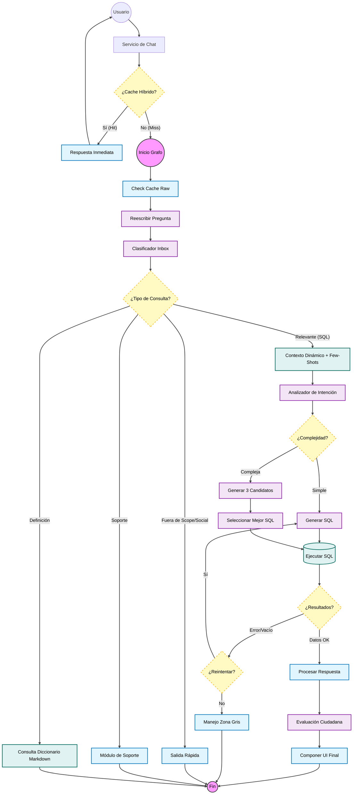

# Arquitectura y Evolución del Chatbot de Inversión Pública

Este documento detalla el flujo técnico, la arquitectura y los desafíos detrás del asistente conversacional de MapaInversiones.

---

## 1. El Origen de los Datos

Todo el sistema se fundamenta en **Datos Abiertos**. La fuente de verdad es la plataforma **MapaInversiones**.

*   **Ingesta**: Los datos estructurados (proyectos, montos, ubicaciones, sectores) provienen de **bases de datos SQL externas o archivos CSV validados**.
*   **Procesamiento**: La información pasa por funciones de **limpieza de texto, tokenización y generación de embeddings** para ser indexada correctamente en la base vectorial y consultable por el modelo.

---

## 2. Arquitectura de Infraestructura

La infraestructura se basa en **Contenedores Docker** para garantizar portabilidad:

*   **Backend API Chat (Python/FastAPI)**: El núcleo lógico que orquesta todas las decisiones y centraliza la comunicación.
*   **Frontend**: Interfaz de usuario ligera.
*   **Persistencia (PostgreSQL + pgvector)**:
    *   *Almacenamiento Relacional*: Datos transaccionales.
    *   *Almacenamiento Vectorial*: Búsqueda semántica.
*   **Inteligencia (Azure OpenAI)**: Consumo seguro de modelos LLM (GPT-4o) para razonamiento.

---

## 3. Flujo de Decisión (Grafo)

El chatbot es un **Grafo de Decisión Estructurado** dividido en tres etapas críticas: **Prefetch**, **Fetch** y **Postfetch**.

### Diagrama de Flujo Completo

### Detalle de las Etapas

1.  **Ruteo Inteligente**:
    *   No todo va a la base de datos. El sistema decide primero si la pregunta es:
        *   **Relevante (SQL)**: Datos de inversión.
        *   **Definición**: Conceptos técnicos (lee de documentos Markdown estáticos).
        *   **Soporte/Social**: Preguntas de ayuda o saludos.
        *   **Fuera de Scope**: Temas no relacionados.

2.  **Prefetch (Análisis y Contexto)**:
    *   La clave es el **Contexto Dinámico**. El sistema reconoce qué palabras se conectan, en qué orden y qué significan realmente.
    *   Recupera "Few-Shots" (ejemplos similares validados) para guiar la generación, asegurando que el modelo entienda la terminología específica del dominio.

3.  **Fetch (Búsqueda Controlada)**:
    *   Convertimos la intención en código SQL.
    *   Para controlar la alucinación, forzamos el uso de los **sustantivos presentes en la fuente de origen** (nombres de municipios, sectores exactos).

4.  **Postfetch (Respuesta)**:
    *   Verificamos si los datos obtenidos tienen sentido.
    *   Si no hay resultados, activamos la **Zona Gris**, explicando qué filtros específicos causaron el vacío en lugar de inventar.

---

## 4. Puntos de Control y Calidad

Para mitigar riesgos, implementamos "semáforos" inteligentes:

*   **Filtro de Seguridad**: Bloquea preguntas inapropiadas o datos sensibles (PII) antes de procesar nada.
*   **Validación de SQL**: Un sistema "linter" corrige errores de sintaxis en el SQL generado por la IA antes de ejecutarlo.
*   **Detección de Vacíos**: Si la búsqueda devuelve cero resultados, el sistema intenta auto-corregirse relajando los filtros antes de rendirse.

---

## 5. El Ciclo de Mejora Continua (Feedback)

Un componente vital, a menudo invisible, es nuestro **Sistema de Retroalimentación**. No lanzamos y olvidamos; el sistema aprende de cada interacción.

*   **Votación Explícita (👍/👎)**: Al final de cada respuesta, el ciudadano puede evaluar la utilidad.
    *   **Positivo**: Valida que la ruta de pensamiento y el SQL generado fueron correctos. Se marca como "Ground Truth" para futuros reentrenamientos.
    *   **Negativo**: Activa una revisión. ¿Falló el SQL? ¿La explicación fue confusa?
*   **Comentarios cualitativos**: El usuario puede explicar *por qué* falló ("La cifra no coincide con el portal oficial"), lo que nos permite detectar errores en los datos origen o en la lógica de cálculo.
*   **Impacto**: Este feedback alimenta directamente la mejora de los "Few-Shots", cerrando el círculo de calidad.

---

## 6. El Desafío del Equilibrio (Costo - Calidad - Tiempo)

Actualmente gestionamos una "Triple Restricción":

*   **Calidad**: Queremos precisión absoluta (Modelos grandes, razonamiento profundo).
*   **Tiempo**: Queremos inmediatez (Modelos rápidos, respuestas en <20s).
*   **Costo**: Debemos ser eficientes con los recursos públicos.

Nuestra solución de **Caché Híbrido** (mostrada al inicio del diagrama) y la arquitectura asíncrona nos permite ser **rápidos en las preguntas frecuentes** y **profundos en las preguntas complejas**, logrando el mejor balance posible.

---

## 7. Próximos Pasos (Evolución)

Para llevar el sistema al siguiente nivel de robustez y confianza, trabajamos en:

1.  **Human-in-the-Loop (3 Estados)**: Separar el chat en etapas interactivas (Propuesta → Confirmación → Ejecución) para que el usuario valide la intención antes de consultar.
2.  **Estabilidad y Concurrencia**: Mejorar el manejo de múltiples usuarios simultáneos.
3.  **Calidad Controlada**: Refinar la precisión mediante feedback directo del usuario.
