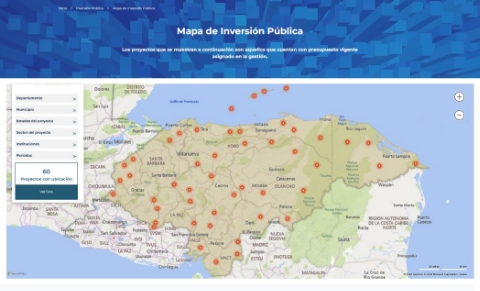
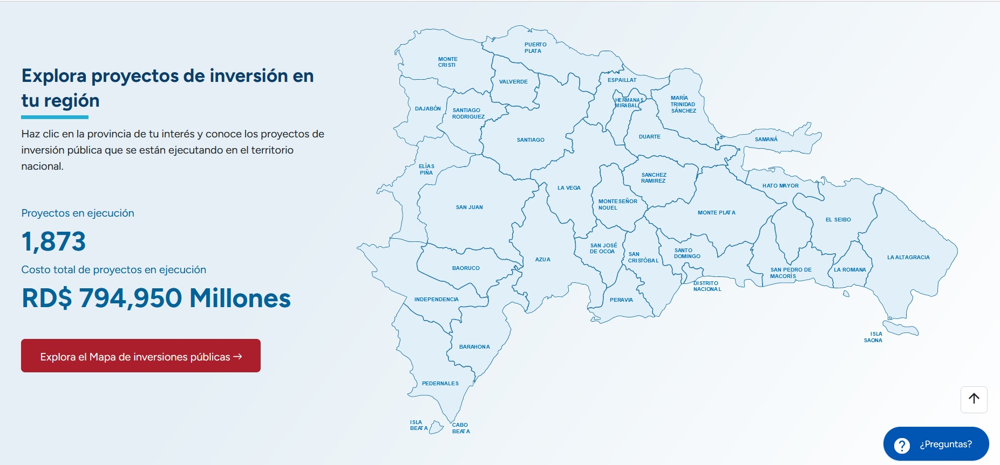
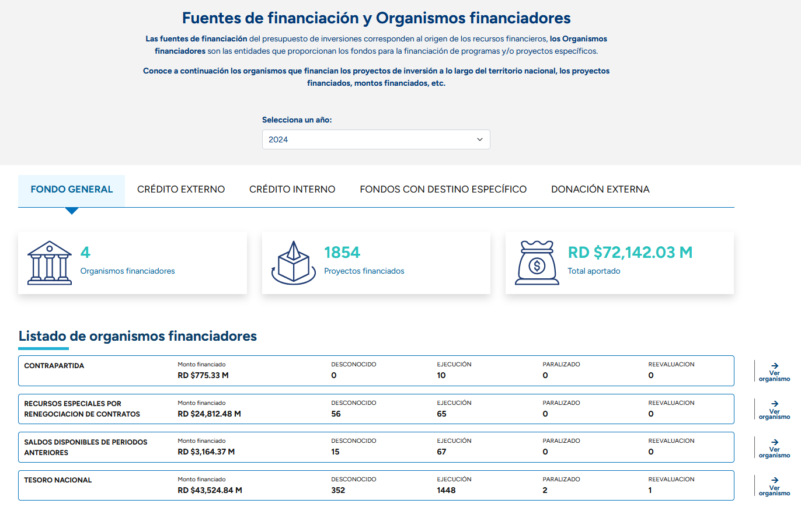
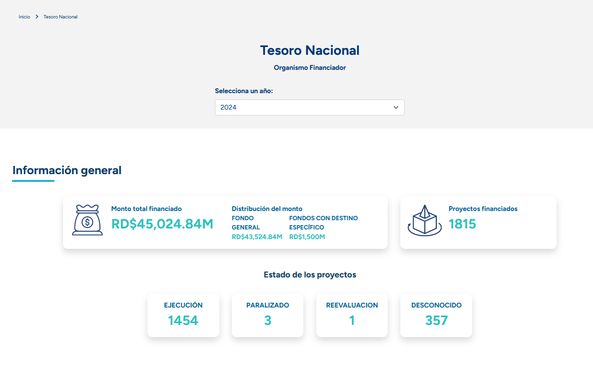
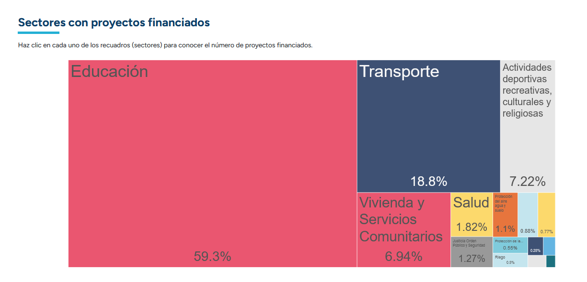
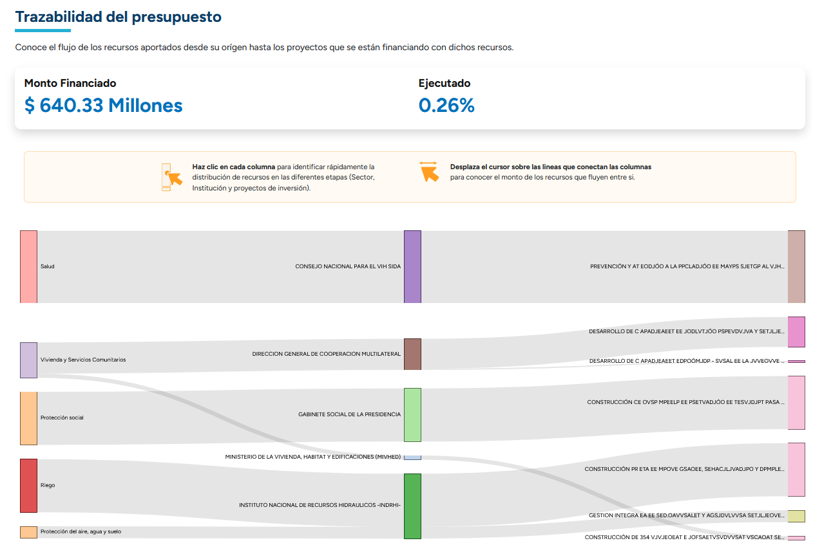

Plataforma que permite gestión de la información para mejorar la transparencia y eficiencia de las inversiones públicas.

## Introducción

Este documento describe los diferentes elementos que se han ido creando en la nueva versión de la plataforma MapaInversiones en la cual se pueden realizar consultas de información general correspondiente a la trazabilidad de la gestión de los recursos públicos, centradas en la georreferenciación de datos, información de planificación y ejecución presupuestaria, inversiones y contrataciones públicas, solo para mencionar algunos de las posibles secciones que se pueden encontrar en la aplicación. En el presente documento se presentan estas secciones, con ejemplos de implementaciones que se han ido realizando.

## Página principal
### Home

La página principal es donde entra por primera vez el usuario y está conformada por diferentes secciones que pueden variar de acuerdo al cliente o el país beneficiario: 

### Encabezado

Al ingresar a la página inicial de MapaInversiones, se visualiza un encabezado compuesto por una parte superior que contiene: el logo de la iniciativa y los enlaces a diferentes secciones como “Acerca de” del sitio, “Marco Legal”, “Preguntas frecuentes” y una opción de “Contáctenos”; además del menú y submenús del sitio. El siguiente menú tiene todos los diferentes elementos y secciones de la aplicación, como los son “Presupuesto”, “Contratación Pública”, “Entidades”, “Inversiones Públicas”, “Participación Ciudadana”, “Datos Abiertos”, “Glosario”. Las secciones varían de acuerdo de la necesidad del proyecto y el cliente, para ajustar el menú de acuerdo a eso se debe entrar por el administrador de la aplicación.

También se encuentra como un “Buscador General”, configurado en un servidor Apache Solr que indexa la diferente información que ofrece el sitio web y permite búsquedas por palabras claves tales como: entidades, planes y programas. 

- > 

### Banners y Anuncios

Esta sección es configurable desde el administrador de contenidos y sirve para resaltar los aspectos principales del sitio y redirigir la navegación de los usuarios a tópicos específicos, tales como infografías o detalles de los procesos de planificación, plan de desarrollo o presupuesto; estos a su vez pueden encontrarse o no dentro del menú superior.

- > 

### Otro tipo de banner

- > 

### Mapa de Inversión publica

En la página principal se puede encontrar de acuerdo a la necesidad del cliente una ficha que envía a la sección de la cual recibe el nombre el proyecto, el Mapa de Inversión. En la imagen de la versión tomada como ejemplo se puede ver un resumen con un enlace o botón que dirige al mapa.

- > 

Una vez se ingresa al mapa dependiendo del cliente, al menos se encontrará el mapa con los diferentes proyectos geolocalizados, lo primero que se ve a la izquierda es un filtro en donde se pueden reducir de acuerdo a los diferentes parámetros de este, cuales proyectos aparecen en el mapa.

- > 

También es posible interactuar con el mapa mediante clics sobre él, pudiéndose seleccionar regiones geográficas, o directamente los puntos con proyectos, estos últimos pueden presentar diferentes tipos de información dependiendo de la cantidad de proyectos que hay en el mismo, cuando hay un solo proyecto aparece el resumen de este, en caso contrario indica que hay más de un proyecto y permite ver la lista para seleccionar el que sea de interés del usuario.

- > 

Una vez seleccionado un proyecto, se procede a ir a su perfil, el cual muestra diferente información que puede variar de acuerdo al cliente o país beneficiario. Generalmente se inicia con un encabezado con información básica del proyecto.

- > 

Después se pueden encontrar secciones con información genera, descripciones, objeticos, avance financiero, avance físico, ejecuciones, entregables componentes y actividades, contratos y gastos asociados, solo por mencionar algunos, como ya se ha mencionado, estos se ajustan o cambias de acuerdo a las necesidades del cliente o a la información que este pueda obtener para mostrar.

- > 

ERn algunas versiones de MapaInveriones se puede encontrar la siguiente sección, donde se presenta un Mapa de Inversión Publica por regiones, para explorar la información correspondiente a los proyectos por cada una de las regiones.

## Fichas resumen

La página inicial muestra cuadros resumen que permiten visualizar datos consolidados de interés para el usuario y el enlace a una página que detalla los mismos. 

### Ficha resumen de Contratos
En algunas implementaciones de MapaInversiones se pueden encontrar la ficha de resumen de Contratos, que permite ver de manera global los cobntratos por año, y una forma mas visual y didactica para el usuario de dirigirse a la sección correspondiente.
- > 

Si se dirige a la sección de contratación pública por medio del botón, llegará a la correspondiente sección de contratación, en donde se visualizará su correspondiente encabezado para seleccionar el año en que quiere revisar la información (se puede modificar para ver todos los años), y el resumen de las fichas.

- > 

También se encontrará el listado de contratos con su correspondiente filtro, en donde se podrán buscar los contratos del año seleccionado, pero mejorando la búsqueda por medio de algunos parámetros adicionales. La información de los contratos también tiene un enlace que permite ir a la información específica del contratista. Por lo general la parte inferior del contrato y del proceso tienen botones para que se pueda ir a buscar más información en los sistemas del cliente.

- > 

Al ingresar al contratista se encuentra una visualización parecida a la de contratos, pero con datos específicos del contratista.

- > 

El listado también se restringe a solo la información del contratista, y sus parámetros de búsqueda solo son el año, y en el caso del ejemplo, la fuente de datos.

- > 

### Ficha resumen Gasto por Entidades

Este cuadro resumen muestra los gastos de las 4 entidades principales (en orden descendente de ejecución), así como el botón para ver la información detallada de todas las entidades. Al hacer clic en el botón “Ver todas las entidades” se visualizará el listado de estas, mostrando los resultados específicos de todas las entidades que se encuentren indexadas.

- > 

Al hacer clic en “Ver todas las entidades”, como se ve en la siguiente imagen, el botón entrega una búsqueda con el filtro por defecto en “Entidad”, con lo cual se puede acceder a cualquiera de las Entidades y llegar al perfil correspondiente a cada una de las mismas.

- > 

El perfil de entidades inicia con un encabezado que permite seleccionar el año del cual se desea revisar la información, junto con un menú fijo, que permite ir de manera rápida a cada una de las secciones de la página.

- > 

La sección de misión y visión, como su nombre lo indica, muestra la información que se tenga en la base de datos respecto a esos dos tópicos relacionados con la entidad.

Más abajo, en la siguiente sección muestra un gráfico Sankey, el cual muestra cómo se relacionan los ejes, objetivos generales y específicos, con el plan nacional de desarrollo.

- > 

Por último, en el perfil de entidad se encuentra una sección donde se encuentran indicadores, actividades y proyectos presupuestarios, de los diferentes programas según la clasificación de los mismos.

- > 

### Ficha resumen de fuentes de financiación

Para implementaciones mas recientes de MapaInversiones se ha incluido fichas de resumen de las fuentes de financiación, en ella se puede encontrar un resumen de las diferentes fuentes, mostrando cantidad en dinero, cantidad en proyectos, y los orgamnismos financiadores relacionados.

- > 

En la parte inferior de esta ficha se puede encontrar un enlace en el que es posible ir a una nueva sección de la plataforma, corriespondiente a los organismos finaciandores.

- > 

Esta sección permite al usuario seleccionar de que año quiere visualizar loos datos, una vez hecho esto se muestra una seccion similar a la del Home, pero en este caso se puede ver el listado completo de los organismos financioadores y las fuentes de financiación. Este listado permite ir a ver el detalle de cada uno de estos organismos

- > 

Al ingresar al detalle del organismo se puede seleccionar el año, lo cual afecta que se va a mostrar en toda la pagina, a continuacion el resumen con la informacion general. 

- > 

Luego se expresa la diferente información en graficas, las cuales se seleccionaron para mostrar la información de forma coeherente el usuario, lo primero que se ve es un TreeMap con los sectores que se financiaron.

En algunas versiones de MapaInversiones tambien es posible encontrar Sankey como el que se ve en la imagen.

- > 

**Fin página principal**

***

La siguiente sección de la página principal muestra una sección dividida. En la parte de la izquierda aparece un listado de noticias, las cuales se configuran desde el administrador de contenido, en estas secciones pueden ver las 4 noticias más recientes, ver una imagen, el título y un pequeño resumen o subtítulo, junto con la fecha publicación, en la parte del título de noticias redirige a la sección completa de noticias, donde se pueden ver todas las que han sido publicadas.

En la parte izquierda se encuentra “sigue la conversación”, en donde se encuentra un widget de Twitter para ver los últimos mensajes publicados por la entidad en esa red social.

- > 

Más adelante el usuario encontrará dos secciones, la primera que muestra el enlace que lo envía a la sección de “Centro de ayuda”, allí puede encontrar tres secciones, una de preguntas frecuentes, otra con un glosario de términos relacionados, y por último a un formato de contacto que sirve para enviar una opinión correo configurado en la aplicación

La siguiente sección es un menú de pie de página, mostrando nuevamente las diferentes secciones de la aplicación. Adicional, después del menú existe una sección que muestra los diferentes logos de las entidades participantes.

- > 

## BACK - Administrador  

Por esta opción de /admin es donde se pueden administrar los contenidos generados por medio de Orchard Core como el centro de ayuda, es decir, categorías, preguntas frecuentes, glosario y el formulario de contáctenos; los elementos de datos abiertos de inversión y proyectos; las noticias y otros componentes importantes, como los banners, anuncios y menús.  

- >   

### Etiquetas de las gráficas. 

Para hacer más eficiente en tiempo y esfuerzo el cambio de los textos asociados a las gráficas y otros textos como notas, se incluyó dentro del gestor de contenidos un tipo de contenido llamado Etiqueta que es llamado dentro de los perfiles y donde se puede tener un título y un texto HTML. Para llegar al gestor hay que entrar con un usuario que tenga permisos de administrador, y entrar a la sección correspondiente.

- > 

Para realizar un llamado se generan variables en cada uno de los perfiles de acuerdo al alias dado a cada etiqueta y se hace llamado al título y al contenido HTML.

- > 

Finalmente, con el equipo de diseño se genera el div donde se va a visualizar la información para que el mismo corresponda a la imagen del sitio.

### Centro de ayuda – formulario de contacto. 

En el centro de ayuda se cuenta con tres divisiones, preguntas frecuentes, glosario y contáctenos. Para este último elemento se creó un tipo de contenido llamado mensaje donde se definen los campos que posteriormente se van a llenar.

- >  

Posteriormente se crea el Workflow o flujo de trabajo correspondiente donde se indica que pasa luego de que el formulario es enviado por el método post desde la página web.

- >  

Después, se crea en la página web el formulario con el llamado al Workflow y los campos correspondientes, donde se cuenta con la validación de los campos requeridos y la estructura de acuerdo al diseño planteado.

De igual manera se generan los espacios para mostrar los mensajes de confirmación de envío, o de error en el proceso según corresponda a los resultados del workflow.

- >  

Como característica de seguridad en los formularios se utiliza la etiqueta @Html.AntiForgeryToken() en el formulario, la misma se utiliza para Validar Token el Antifalsificación, para asegurar que los valores del formulario no se hayan modificado.

- >  

En el momento que se realizó la instalación en el servidor de producción se genera un error en el llamado al workflow, por esta razón se ocultó la parte del formulario de contáctenos y solo se dejaron las preguntas frecuentes y el glosario en el centro de ayuda. Se realizaron los ajustes para no mostrar la sección correspondiente y también se agregaron clases para resaltar el elemento seleccionado actualmente, ya sea una pregunta o una palabra del glosario.

### Ajuste a la página de noticias.

Se ajustó la página de noticias para incluir la imagen que se carga dentro del blog post en el gestor de contenido y realizar el llamado con la función Orchard.MarkdownToHtmlAsync, con el fin de mantener el estilo HTML utilizado en el gestor de contenido.

- >  

